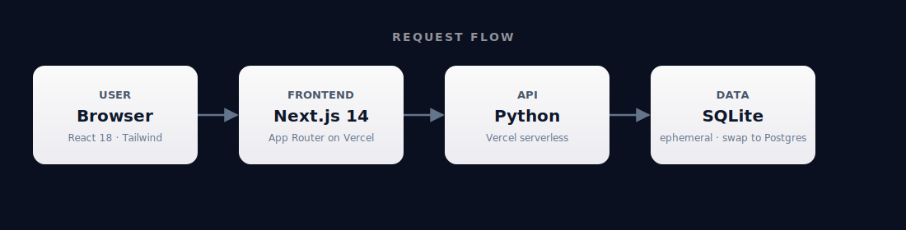

<div align="center">


# SaaS Toolkit Platform for Solo Founders

### Curated toolkit and integrated resource platform addressing the pain point of solo SaaS developers needing multiple tools. Direct demand signal from 215 HN discussion asking for essential tools.

**Repo:** <https://github.com/malikmuhammadsaadshafiq-dev/saas-toolkit-platform-for-solo-1953>

      

</div>

---

## What is this?

Curated toolkit and integrated resource platform addressing the pain point of solo SaaS developers needing multiple tools. Direct demand signal from 215 HN discussion asking for essential tools.

This repository was generated end-to-end by **[MVP Factory](https://github.com/malikmuhammadsaadshafiq-dev)** — eight specialized AI agents that research a real-world demand signal, design the system, write the code, test it, and ship it to Vercel.

## ✅ What works right now

- The frontend renders at **the deployed Vercel URL** as soon as Vercel finishes the first build.
- ⚠️ The code reads 2 env var(s): `DATABASE_URL`, `JWT_SECRET`. These **must be set on the Vercel project** (_Settings → Environment Variables_) — otherwise the live URL will return 500 wherever those values are touched. See the *Environment variables* section below for where to obtain each.
- ⚠️ Storage is **SQLite running inside a serverless function — fully ephemeral**. Every cold start gets a fresh empty DB. Fine for demos; **for real users you must swap to Postgres** (see *Going to production* below).

## Architecture

<div align="center">



</div>

| Layer | Technology | Where it runs |
|-------|------------|---------------|
| Frontend | Next.js 14 + Tailwind | Vercel Edge / CDN |
| Backend | Python serverless (FastAPI / handler functions) | Vercel Python runtime — each `api/*.py` is a stateless function |
| Storage | SQLite | In the function's filesystem (ephemeral) — swap `DATABASE_URL` for Postgres in prod |

Each file under `api/` is deployed by Vercel as an independent serverless Python function. There is **no long-running server** — functions cold-start on request and scale to zero. Shared modules (`models.py`, `database.py`) are imported by the route files.

## 🚀 Quick start (5 minutes)

### Prerequisites

- **Node.js 18+** — verify with `node --version`
- **Git**
- **Python 3.11+** — verify with `python --version`
- **Vercel CLI** — `npm i -g vercel` (needed to emulate Python serverless locally)

### 1. Clone

```bash
git clone https://github.com/malikmuhammadsaadshafiq-dev/saas-toolkit-platform-for-solo-1953
cd saas-toolkit-platform-for-solo-1953
```

### 2. Install

```bash
npm install
```

### 3. Configure environment

```bash
cp .env.local.example .env.local
```

Open `.env.local` and fill in the real values (see *Environment variables* below for where to get each one).

### 4. Run

```bash
vercel dev
```

Open <http://localhost:3000>. The Python `/api/*` routes only execute under `vercel dev` because they need the Vercel Python runtime emulator.

## Environment variables

Set these locally in `.env.local` **and** on the Vercel project (Settings → Environment Variables). The repo ships with a fully-commented `.env.local.example` template — `cp .env.local.example .env.local` and fill it in.

| Variable | Where to get it |
|----------|-----------------|
| `DATABASE_URL` | Vercel Postgres / Neon / Supabase connection string |
| `JWT_SECRET` | Generate: openssl rand -base64 32 |

## 📦 Deploy your own copy

### Option A — One-click via Vercel (easiest)

[](https://vercel.com/new/clone?repository-url=https://github.com/malikmuhammadsaadshafiq-dev/saas-toolkit-platform-for-solo-1953)

1. Click the button (or open <https://vercel.com/new>) and import the repo.
2. On the Vercel import screen, paste the env vars listed under *Environment variables* above. Vercel will then build and serve the deployment.
3. Vercel auto-deploys on every push to `main` from then on.

### Option B — Vercel CLI

```bash
npm i -g vercel
git clone https://github.com/malikmuhammadsaadshafiq-dev/saas-toolkit-platform-for-solo-1953
cd saas-toolkit-platform-for-solo-1953
vercel link
# Push the env vars to Vercel (run once per var, paste the value when prompted):
vercel env add DATABASE_URL
vercel env add JWT_SECRET

vercel --prod
```

## 🏭 Going to production

- **Swap SQLite for Postgres.** SQLite on Vercel resets on every cold start. Pick any of: [Vercel Postgres](https://vercel.com/storage/postgres), [Neon](https://neon.tech), [Supabase](https://supabase.com). Grab the connection string, set `DATABASE_URL` in Vercel project settings, and the code will pick it up automatically (the abstraction layer reads `DATABASE_URL` first, falls back to local SQLite for dev).
- **Wire up real keys.** The deployed URL will surface 500s on any code path that touches an unset env var. Set every variable from the *Environment variables* table inside Vercel before sharing the link.
- **Custom domain.** Vercel project → Settings → Domains → Add. The `.vercel.app` URL works fine for testing but is rate-limited and not great for branding.
- **Analytics.** Vercel Web Analytics is one click away under the project's Analytics tab. Plausible / PostHog are also a 5-line snippet drop-in.

## Project structure

```
api/
  auth.py
  database.py
  index.py
  models.py
  requirements.txt
  routes/
  schemas.py
  seed.py
  ... (2 more)
next-env.d.ts
next.config.js
package-lock.json
package.json
postcss.config.js
README.md
src/
  app/
  components/
  lib/
tailwind.config.js
tsconfig.json
vercel.json
```

## API surface

**Python serverless functions** (`api/*.py` → Vercel functions):

```
/api/auth
/api/database (helper, not an HTTP route in code)
/api
/api/models (helper, not an HTTP route in code)
/api/schemas (helper, not an HTTP route in code)
/api/seed
/api/seed_stacks
/api/seed_tools
```

## 🛠 Troubleshooting

| Issue | Fix |
|-------|-----|
| `'next' is not recognized` | You skipped step 2 — run `npm install`. |
| `Module not found` errors | Run `npm install` again, then delete `.next/` and retry. |
| Port 3000 already in use | `npx kill-port 3000`, or run with `PORT=3001 npm run dev`. |
| Live URL returns 500 on a real action | Env vars not set on Vercel. Project → Settings → Environment Variables → add the keys from the table above, then redeploy. |
| Data disappears between requests on the live URL | Expected — SQLite is ephemeral on serverless. Move to Postgres (see *Going to production*). |
| `/api/*` returns 404 in `npm run dev` | Python routes only run under `vercel dev`. Switch the dev command and try again. |

## For AI agents reading this repo

- **Stack:** Next.js 14 frontend + Python serverless (FastAPI / handler functions)
- **Run locally:** `npm install && npm run dev` (port 3000) — use `vercel dev` to also emulate Python serverless functions
- **Backend lives at:** `api/`
- **Backend runs as:** Vercel Python runtime — each `api/*.py` is a stateless function
- **No long-running server processes** — every request hits a fresh function instance.
- **Storage:** SQLite
- **Required env vars:** `DATABASE_URL`, `JWT_SECRET`

## License

MIT — generated autonomously by [MVP Factory](https://github.com/malikmuhammadsaadshafiq-dev).
